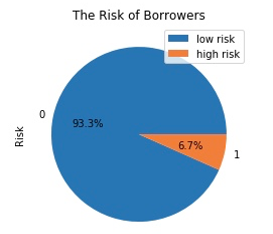

# Loan Default Prediction For Credit Approval Decision


> This report attempts to analyze existing loan applicant data to predict risk type (high risk/ low risk) of forthcoming applicants using machine learning algorithms.


## Table of contents
* [General info](#general-info)
* [Technologies](#technologies)
* [Raw data](#Raw-data)
* [Dataset description](#Dataset-description)
* [Data preparation and analysis steps](#Data-preparation-and-analysis-steps)
* [Data visualization](#Data-visualization)
* [Conclusion](#Conclusion)
* [Recommendation](#Recommendation)
* [Contact](#contact)


## General info
Bad loans, a.k.a. debts that are not recovered on time, are one of the most common causes of bank revenue losses and sometimes bankruptcy. This was one of the major drives of the financial crisis, also the US recession, in 2009 and could have been avoided if the banks had carefully chosen their borrowers.

Nowadays, many banks invest largely into risk management or credit appraisal to obtain better, scientific and data-driven input for lending decisions. This project depicts an example of how a bank can categorize borrowers into low risk or high risk of loan default.


## Technologies
### Data analytics tool: Python
### Analytics techniques:
* Problem identification: supervised learning – binary classification problem, predicting the probability of 2 output classes, low risk and high risk
* Machine learning modeling & analysis: Random forest classifier and Multi-layer perceptron (MLP) classifier


## Raw data

The data used in this project is a real-world dataset obtained from a bank in the US, containing 100,000 samples. 


## Dataset description

Variable Name | Description | Type
--- | --- | ---
Age	| Age of the borrower (in years)	Integer
Debt Ratio | The ratio of monthly debt payments to monthly gross income	| Continuous between 0 and 1
LOC	| Number of open loans and lines of credit | Integer
Income | Monthly income of the borrower	| Continuous
MREL | Number of mortgage and real estate loans | Integer
Dependents | Number of dependents of the borrower	| Integer
Utilization	| The ratio of total balance on lines of credit to the total credit limits | Continuous between 0 and 1
30Day	| Number of times the borrower has been 30-59 days past the due date in the last two years | Integer 
60Day	| Number of times the borrower has been 60-89 days past the due date in the last two years | Integer 
90Day	| Number of times the borrower has been equal to or more than 90 days past the due date | Integer 
Risk | The risk associated with the borrower	| Binary 


## Data preparation and analysis steps

### 1. Data cleaning
* Handle user input errors in column names and data types
* Handle missing values using 3 methods
####	Alternative #1: Discard incomplete rows, resulting in LoanData1 dataset
####	Alternative #2: Discard variable containing more than 10% missing values and substitute remaining missing values with the median of that variable, resulting in LoanData2 dataset
####	Alternative #3: Discard variable containing more than 10% missing values and substitute remaining missing values with the median of that variable; afterthat, oversample to result in LoanData3 dataset

Why oversampling?

The LoanData2 dataset has extremely imbalanced dependent variable with 93% classified as “high risk” (coded 0). 



With this situation, the machine learning algorithm can classify all the rows as 0 (without learning any useful information) and still get an accuracy rate at 93%. To overcome this drawback of imbalanced dataset, I will employ oversampling method, using SMOTE - Synthetic Minority Oversampling Technique, to increase the high-risk case to achieve a 1:5 ratio – For every 1 high risk, there will be 5 low risk.

```python
#Upsampling, using SMOTE library, by increasing the minority class (1 - high risk)
X = pd.DataFrame(LoanData2.iloc[:,:-1])
y = pd.DataFrame(LoanData2.iloc[:,-1])

sm = SMOTE(random_state=8810, sampling_strategy = 0.2) #Ratio of minority:majority = 1:5
X_res, y_res = sm.fit_sample(X,y)
```

### 2. Splitting data into Training and Testing datasets

Each datasets is split into training and testing datasets with the 7:3 ratio – 70% training data and 30% testing data.
LoanData1 --> X_train1, X_test1, y_train1, y_test1
LoanData2 --> X_train2, X_test2, y_train2, y_test2
LoanData3 --> X_train3, X_test3, y_train3, y_test3


### 3. Learning from datasets and making Predictions

In order to solve a problem having binary dependent variable, I use 2 following methods:

*	Random Forest Classifier

```python
#Initialize the Random Forest Classifier and let the model learn from the LoanData1 dataset
RF1_class = RandomForestClassifier(n_estimators=50)
RF1_class = RF1_class.fit(X_train1, y_train1)

#Do the same for the other 2 datasets
```

* Multi-Layer Perceptron (MLP) Classifier

```python
#Determine number of hidden layers and number of hidden nodes in each layer, based on Accuracy Score, using LoanData1
df = pd.DataFrame(columns=["firstLayer_N","2ndLayer_0N","2ndLayer_1N","2ndLayer_2N","2ndLayer_3N","2ndLayer_4N"
                           ,"2ndLayer_5N"])

for i in range(7):           #i is the number of nodes in second hidden layer
    for j in range(1,21):    #j is the number of nodes in first hidden layer
        if i == 0:
            df[df.columns[i]] = range(1,21)
        elif i == 1:
            MLP1_class = MLPClassifier(hidden_layer_sizes=(j), solver='lbfgs', alpha=1e-05, random_state=8810
                                       , max_iter=500).fit(X_train1, y_train1)
            y_pred_MLP1 = MLP1_class.predict(X_test1)
            Accuracy_MLP1 = metrics.accuracy_score(y_test1, y_pred_MLP1)
            df[df.columns[i]][j-1] = Accuracy_MLP1
        else:
            MLP1_class = MLPClassifier(hidden_layer_sizes=(j,i), solver='lbfgs', alpha=1e-05, random_state=8810
                                       , max_iter=500).fit(X_train1, y_train1)
            y_pred_MLP1 = MLP1_class.predict(X_test1)
            Accuracy_MLP1 = metrics.accuracy_score(y_test1, y_pred_MLP1)
            df[df.columns[i]][j-1] = Accuracy_MLP1
```

```python
#Train the LoanData1 dataset with the MLP Classifier
MLP1_class = MLPClassifier(hidden_layer_sizes=(5,2), solver='lbfgs', alpha=1e-05, random_state=8810, max_iter=500)
MLP1_class = MLP1_class.fit(X_train1, y_train1)

#Do the same for the other 2 datasets
```

## Data visualization

Interactive Tableau dashboard:
https://tabsoft.co/2OCUB1G


## Conclusion

* Market segmentation: there's a big discrepancy in consumer’s needs; Some homes price $400,000, some price less than $100,000
* Loan default risk: some areas have crazily high ratio of home price to household median income, e.g. 14.7, mainly due to too low median household income
* Sales territory: almost 80% of customers live within 20 miles from the company's office


## Recommendation

- To avoid loan default risk: by targeting the customers who are capable of buying its homes and only approve the applicants having low risks of mortgage loan default 
- To have a comprehensive market segmentation: by collecting customer’s financial health, such as credit score, individual and household incomes
- To identify key products: by collecting  KPIs of homes purchased, such as home purchase price,  gross income, operating expenses, vacancy rate


## Contact
Created by [@lucy-playing-data](https://lucyplayingdata.wordpress.com) - feel free to contact me!
