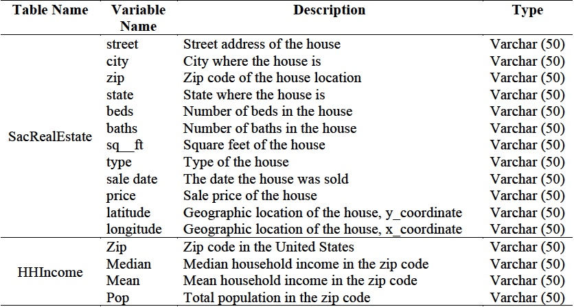
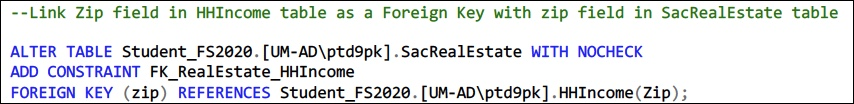
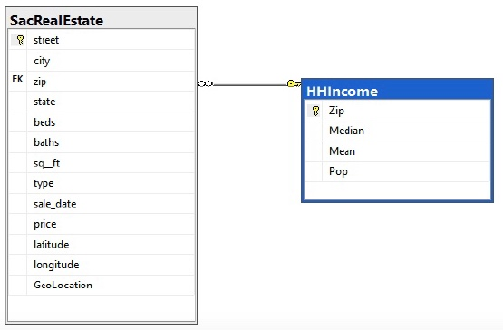
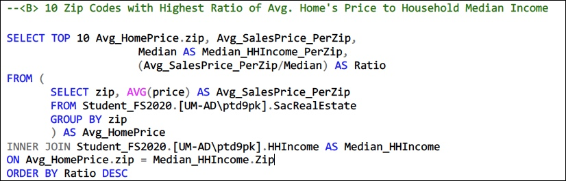
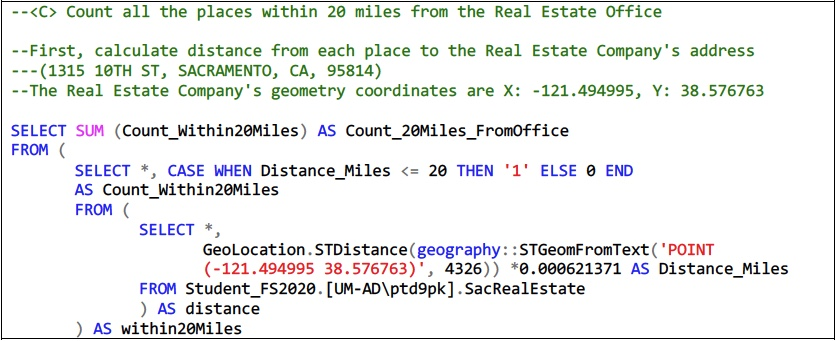

# Market Analysis on Real Estate in Sacramento, CA

> This report attempts to analyze customer profiles and transaction data to obtain better understanding about real estate customers in Sacramento CA, thus providing input to re-identify customers and tailor marketing messages.


## Table of contents
* [General info](#general-info)
* [Technologies](#technologies)
* [Raw data](#Raw-data)
* [Dataset description](#Dataset-description)
* [Data preparation and analysis steps](#Data-preparation-and-analysis-steps)
* [Data visualization](#Data-visualization)
* [Conclusion](#Conclusion)
* [Recommendation](#Recommendation)
* [Contact](#contact)


## General info
Like many other counties in California, Sacramento is one of the most competitive real estate markets of the United States. According to statistics of Redfin (2020), the average home price in Sacramento, US is $360,000 dollars, up by almost 7% compared to last year and equivalent to 125% national average price. More impressively, its sales price per square foot reaches $252, increasing by 12% since last year.

Because of the high potential of this market, ABCD Real Estate Co. has faced with harsh competition. In order to optimize resources, the company should target right customer segments and deliver customized messages to them. With that in mind, this report is compiled to garner profile of ABCD’s customers in Sacramento county, including their demographics and transaction details, to derive meaningful insights driving actionable recommendations and strategic plans in next phase.


## Technologies
* Microsoft SQL Server: to query, map out, wrangle and analyze data
* Tableau: to visualize key metrics


## Raw data

* 1st dataset: SacRealEstate, containing 986 records of the past transactions conducted in 2008, with information about house address (street, city, zip, geographic location), house information (number of beds, number of baths, square feet, type) and transaction details (sales date, price). 
* 2nd dataset: HHIncome, containing median and mean household income of 32,634 zip codes in the US during the 2006-2010 period. 


## Dataset description



## Data preparation and analysis steps

### 1. Data preparation
* Load 2 datasets into SQL Server using SQL Server Import and Export Wizard
* Convert data type, handling data errors and creating new calculated columns
* Design data schema


Resulting data map:



### 2. Data analysis and syntax examples

*	Calculate Average Sales Price of homes for each Zip Code
* Find 10 Zip Codes having the highest Ratio of Average Home Price to Median Household Income

```
--<B> Zip Code with Highest Ratio of Average Home's Price to Household Median Income

SELECT TOP 10 Avg_HomePrice.zip, Avg_SalesPrice_PerZip, 
			Median AS Median_HHIncome_PerZip,
			ROUND((Avg_SalesPrice_PerZip * 1.0 /Median),2) AS Ratio
FROM (
	SELECT zip, AVG(price) AS Avg_SalesPrice_PerZip
	FROM Student_FS2020.[UM-AD\ptd9pk].SacRealEstate
	GROUP BY zip
	) AS Avg_HomePrice
INNER JOIN Student_FS2020.[UM-AD\ptd9pk].HHIncome AS Median_HHIncome
ON Avg_HomePrice.zip = Median_HHIncome.Zip
ORDER BY Ratio DESC
```



* Find the customers living within 20-mile radius of the Real Estate Office




## Data visualization

Interactive Tableau dashboard:
https://tabsoft.co/2OCUB1G


## Conclusion

* Market segmentation: there's a big discrepancy in consumer’s needs; Some homes price $400,000, some price less than $100,000
* Loan default risk: some areas have crazily high ratio of home price to household median income, e.g. 14.7, mainly due to too low median household income
* Sales territory: almost 80% of customers live within 20 miles from the company's office


## Recommendation

- To avoid loan default risk: by targeting the customers who are capable of buying its homes and only approve the applicants having low risks of mortgage loan default 
- To have a comprehensive market segmentation: by collecting customer’s financial health, such as credit score, individual and household incomes
- To identify key products: by collecting  KPIs of homes purchased, such as home purchase price,  gross income, operating expenses, vacancy rate


## Contact
Created by [@lucy-playing-data](https://lucyplayingdata.wordpress.com) - feel free to contact me!
